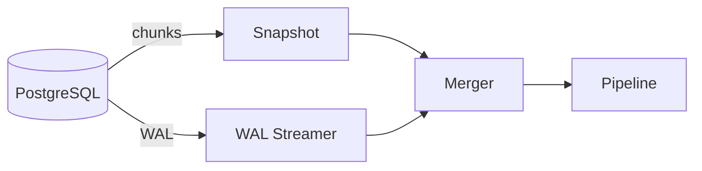

# PostgresConnector

`PostgresConnector` (package `pg`) captures a Postgres database as a CDC stream. It first snapshots all existing rows in ascending PK order, then switches to streaming live changes via WAL logical replication — delivering every change at least once with crash-safe resume.

## Prerequisites

```sql
wal_level = logical
```

The connector creates the replication slot and publication automatically on first run. All captured tables must have a single-column primary key (`bigint`/`bigserial` or `uuid`). The primary key column defaults to `id` and can be overridden per table via `CDCTable.PKColumn`.

## How it works

The connector operates in two sequential phases: **snapshotting** and **streaming**. The current phase is stored in the offset store and survives restarts.



### Incremental snapshotting

When the connector starts for the first time (or resumes with `phase = snapshotting`), it scans each configured table sequentially in the order they appear in `Config.Tables`.

#### Chunk-by-chunk scanning

Each table is read in fixed-size windows of `ChunkSize` rows ordered by ascending `id`. Each window is called a **chunk**. Each chunk runs in its own `REPEATABLE READ` transaction, which gives the connector a consistent row snapshot and a transaction snapshot identifier (`xmin`) for that window.

#### Resuming after a crash

The snapshot cursor (`CDCState.SnapshotCursor`) holds the highest acknowledged PK. On restart, the scanner skips rows with `id <= SnapshotCursor` and resumes from the next row. Chunks that were in progress but not yet fully acknowledged are re-scanned from scratch — downstream may therefore see the same rows again, which is expected under the at-least-once guarantee.

`CDCState.SnapshotTable` tracks which table was being scanned, so already-completed tables are not revisited.

### Streaming mode

Once every configured table has been fully scanned the connector transitions to `PhaseStreaming`. This state is persisted immediately so a restart goes directly to streaming.

#### WAL logical replication

The WAL streamer holds a dedicated replication connection and calls `START_REPLICATION` using the `pgoutput` plugin. It decodes the logical replication stream into `CDCEvent`.

Events within a single Postgres transaction are accumulated in a buffer and forwarded to the output channel together when the `COMMIT` message arrives. This means the pipeline always sees complete, committed transactions — partial transaction states are never visible.

#### LSN tracking and slot hygiene

Every 10 seconds the streamer sends a `StandbyStatusUpdate` to Postgres reporting the highest confirmed LSN. Postgres uses this to advance the replication slot's `confirmed_flush_lsn`, which allows it to reclaim WAL segments that are no longer needed. If the pipeline is shut down without advancing the LSN for an extended period, Postgres will accumulate WAL on disk until the slot is caught up or dropped.

On restart in streaming mode the streamer resumes from `CDCState.ConfirmedLSN`, so no events are skipped.

### Overlap and deduplication (the merger)

Because the WAL streamer starts before the snapshot goroutine, live changes arrive while the snapshot is still running. The **merger** prevents the same logical row from being emitted twice.

For every chunk the merger:

1. Records the expected PK range before the chunk query runs (`onBeginChunk`).
2. Buffers incoming WAL events whose PK falls inside that range (`pendingWALEvents`).
3. After the chunk query commits and `xmin` is known (`onEndChunk`):
   - Buffered WAL events with `commitXID >= xmin` are emitted — they represent changes that happened **after** the snapshot row was read and are therefore new information.
   - Buffered WAL events with `commitXID < xmin` are discarded — the snapshot already captured the row's state at or after that point.
   - Events outside the actual scanned range are carried forward as overflow for the chunk that will eventually cover those IDs.

For rows in already-completed chunks, the merger holds a `scannedRanges` list and emits WAL events immediately when their `commitXID >= xmin` of the range that covered them.

For rows not yet reached by the snapshot, WAL events are discarded: the snapshot will read and emit the row's current state when it gets there.

When the snapshot completes (`onSnapshotComplete`), any remaining overflow events (rows beyond the last scanned row) are flushed and the merger switches to pass-through mode for all subsequent WAL events.

## Handling CDC events

The message payload is a `pg.CDCEvent`. Use `pg.ParseRow` to decode the row into a typed struct, then switch on the operation:

```go
type Order struct {
    ID    int64  `json:"id"`
    Total int    `json:"total"`
}

func (p *MyCDCProcessor) Handle(msg *broadway.Message, ctx context.Context) (*broadway.Message, error) {
    event := msg.Payload.(pg.CDCEvent)

    switch event.Operation {
    case pg.OperationRead, pg.OperationInsert:
        order, err := pg.ParseRow[Order](event.After)
    case pg.OperationUpdate:
        before, err := pg.ParseRow[Order](event.Before)
        after, err  := pg.ParseRow[Order](event.After)
    case pg.OperationDelete:
        order, err := pg.ParseRow[Order](event.Before)
    }

    return msg, nil
}
```

## Offset store

Offsets are persisted after every acknowledged batch. On restart the connector resumes from the last confirmed position — snapshot chunks that were not fully acknowledged are re-scanned, and WAL re-delivers from the last confirmed LSN.

By default the connector persists offsets to a `_pgcdc_offsets` table in the source database via `PostgresOffsetStore`. Pass a custom implementation to store offsets elsewhere — for example, in Redis or a separate database:

```go
connector := pg.New(pg.Config{
    // ...
    OffsetStore: &MyOffsetStore{},
})
```

## Configuration reference

| Field | Type | Default | Description |
|---|---|---|---|
| `ConnectionString` | `string` | — | Postgres connection string |
| `SlotName` | `string` | — | Replication slot name (created if absent) |
| `Publication` | `string` | — | Publication name (created if absent) |
| `Tables` | `[]CDCTable` | — | Tables to capture; each entry sets `Name` (schema-qualified) and optionally `PKColumn` (default `"id"`) |
| `ChunkSize` | `int` | `1000` | Rows per snapshot chunk |
| `BufferSize` | `int` | `1000` | Internal event buffer capacity |
| `OffsetStore` | `OffsetStore` | Postgres | Where to persist CDC offsets |
